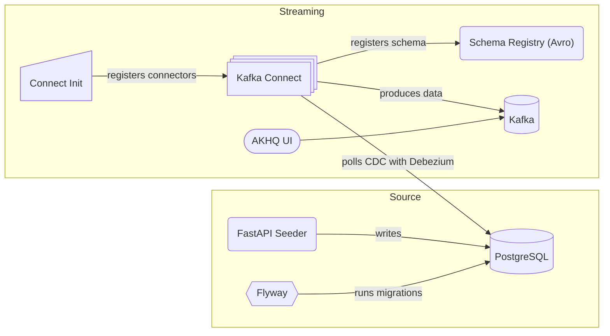

# Getting started

**Architecture**

Running the stack, i.e., layers:

- OLTP Source and Seeder: `docker compose -f docker-compose.source.yaml`
- Streaming: `docker compose -f docker-compose.streaming.yaml`

## OLTP Source

Postgres is used as OLTP source. You can connect to it with localhost:4444 and postgres:postgres as root user:password. To create a new database, use:

`docker compose -f docker-compose.source.yaml exec postgres psql -U postgres -d postgres -c "CREATE DATABASE storefront;"`

Make sure to add the created database to `postgres-init/init.sql`, if meant to be permanent.

Hint: for a multi-database setup, you will need to adjust the flyway urls; for now, it is set up with the defualt `storefront` db.

### Migrations

Migrations are handled by flyway in `migrations/`. To apply migrations, run:

`docker compose -f docker-compose.source.yaml up flyway`

### Seeder

FastAPI is used to seed the database with a full load and ongoing deltas. Check the Swagger UI at [localhost:8000/docs](http://localhost:8000/docs).

## Kafka Streaming

Kafka is used for Streaming. Check out AKHQ at [localhost:9000](http://localhost:9000) to manage Kafka.

### Connectors

All connectors are defined in connectors/\*.template.json; use `docker compose -f docker-compose.streaming.yaml up connect-init` to apply the templates, where variables are substituted from `.env`.

List connectores with `curl http://localhost:8083/connectors` \
Delete connector with, e.g., `curl -X DELETE http://localhost:8083/connectors/storefront-postgres-connector`

Currently, CDC for Postgres is handled by Debezium. This includes (a) the additon of the connector plugin to the connect image `Dockerfile.connect` (b) the creation of the debezium user with the appropritate roles in Postgres `migrations/V2__create_debezium_user.sql` (c) the proper connector config `connectors/debezium-postgres.template.json` (d) Postgres' write-ahead log set to allow logical replication, see `wal_level = logical` in `compose/postgresql.custom.conf`.

### Topics

Strategy, example with Postgres CDC:

- Default setting delete.retention.ms is `86400000` (1 day). That is, either downstream is polling all messages or the connector has to be reset to push a inital snapshot to Kafka. To reset the debezium connector, just delete it and re-run the connect-init.
- Default setting cleanup.policy is `delete`. However, `compact,delete` can make sense for a lake house downstream.

# Development

## Playing around

Jupyter notebooks can be found in `jupyter/`. Make sure to add the requirements in `jupyter/requirements.txt`.

## Linting

Pre-commit is used for linting. Run `pre-commit install` once to initialize it for this repo.
