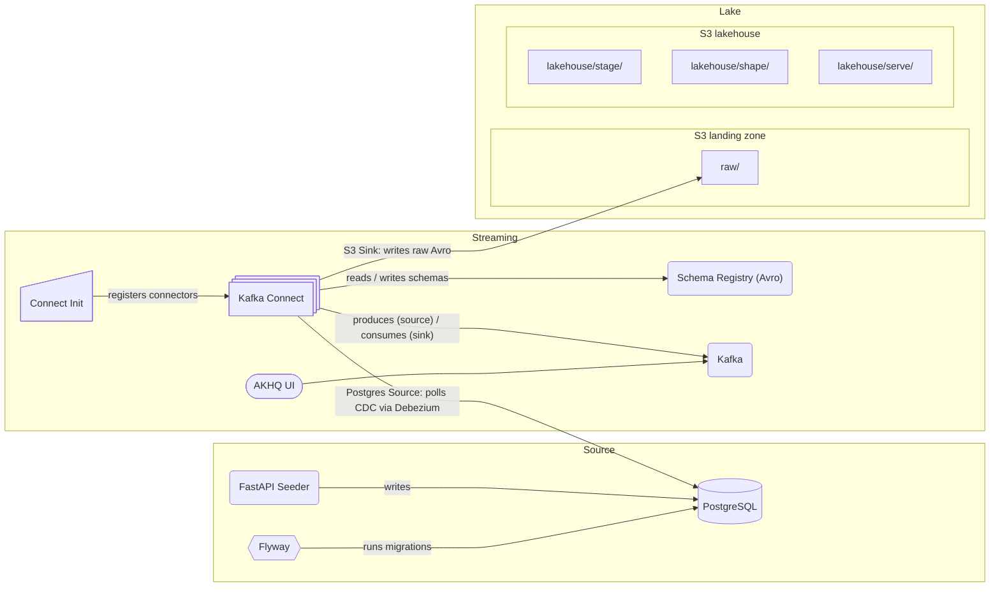

# haus-am-see

Data playground by the lake; meant to simulate end-to-end data pipelines.

## Getting started

1. Compose up source services: `docker compose -f docker-compose.source.yaml up`
   1. Use the FastAI seeder at [localhost:8000/docs](http://localhost:8000/docs) and run /seed/full to generate records in the source Postgres
   2. [Optional] Connect to the Postgres `localhost:4444` with user:password `postgres:postgres`. You can find the generated records in the storefront db.

2. Compose up streaming services: `docker compose -f docker-compose.streaming.yaml up`
   1. Register the Postgres connector with `docker compose -f docker-compose.streaming.yaml run --rm connect-postgres`. This will initially full load all records and keep streaming via CDC.
   2. [Optional] Check AKHQ on [localhost:8080](http://localhost:8080) to view the created topics and schemas.

3. Compose up lake services: `docker compose -f docker-compose.lake.yaml up`
   1. Check buckets (raw, lakehouse) at [localhost:9001](http://localhost:9001) with user:password `minio:minio123`.
   2. Register the S3 connector with `docker compose -f docker-compose.streaming.yaml run --rm connect-s3`. This will initially full load all records and keep streaming the registered topics into the `raw` bucket.

### Compose overview:

```bash
# Source
docker compose -f docker-compose.source.yaml up

# Streaming
docker compose -f docker-compose.streaming.yaml up

# Lake
docker compose -f docker-compose.lake.yaml up

# Register connectors
docker compose -f docker-compose.streaming.yaml run --rm connect-postgres
docker compose -f docker-compose.streaming.yaml run --rm connect-s3
```

### Architecture



## Source (Postgres)

Postgres is used as OLTP source. The default `storefront` database is meant to simulate a web shop.

- Connect via `localhost:4444` | user:password: `postgres:postgres`
- You can create a new database with, e.g.:
  ```bash
  docker compose -f docker-compose.source.yaml exec postgres psql -U postgres -d postgres -c "CREATE DATABASE storefront;"
  ```
- If meant to be persisted, add the new database to `postgres-init/init.sql`.

### Migrations

Flyway is used as migration tool.

- Run migrations on the default `storefront` database via:
  ```bash
  docker compose -f docker-compose.source.yaml up flyway
  ```

### FastAPI Seeder

Use the endpoints on [localhost:8000/docs](http://localhost:8000/docs) to run a initial fill or start/stop continuous, simulated traffic.

## Streaming (Kafka)

Kafka is used for streaming CDC events from Postgres via Debezium to the S3 ingest sink in the lake. You can use the AKHQ UI at [localhost:8080](http://localhost:8080) to monitor/manage it.

### Connectors

All connectors are defined in `connectors/*.template.json`. envsubst is used to substitute `.env` variables.

- Register connector:

  ```bash
  # Postgres Source
  docker compose -f docker-compose.streaming.yaml up connect-postgres
  # S3 Sink
  docker compose -f docker-compose.streaming.yaml up connect-s3

  # .. per curl
  curl -X POST -H "Content-Type: application/json" --data "@/connectors/postgres-source.json" http://connect:8083/connectors;
  ```

- List registered connectors:
  ```bash
  curl http://localhost:8083/connectors
  ```
- Check connector status:
  ```bash
  curl http://localhost:8083/connectors/postgres-source-storefront/status
  ```
- Delete connector:
  ```bash
  curl -X DELETE http://localhost:8083/connectors/postgres-source-storefront
  ```

To add a new connector, create a template in `connectors/*.template.json` and either register it manually (see command above) or add another service to `docker-compose.streaming.yaml`.

#### S3 Sink:

Example of resetting a sink connector:

```bash
# Delete connector
curl -X DELETE http://localhost:8083/connectors/s3-sink-storefront

# Reset offsets
docker exec -it kafka kafka-consumer-groups \
  --bootstrap-server localhost:9092 \
  --group connect-s3-sink-storefront \
  --reset-offsets \
  --all-topics \
  --to-earliest \
  --execute

# Add connector
docker compose -f docker-compose.streaming.yaml run --rm connect-s3
```

### Debezium CDC on Postgres

Currently, CDC for Postgres is handled by Debezium. This includes:

- the addition of the connector plugin to the `Dockerfile.connect` image
- the creation of the Debezium user with the appropriate roles in Postgres `migrations/V2__create_debezium_user.sql`
- the proper connector config `connectors/debezium-postgres.template.json`
- Postgres' write-ahead log set to allow logical replication, see `wal_level=logical` in `compose/postgresql.custom.conf`

### Topics

Strategy, example with Postgres CDC:

- Default setting `delete.retention.ms` is `86400000` (1 day). That is, either downstream is polling all messages or the connector has to be reset to push an initial snapshot to Kafka. To reset the Debezium connector, delete it and re-run the connect-init.
- Default setting `cleanup.policy` is `delete`. However, `compact,delete` can make sense for a lakehouse downstream.

## Lake (S3 via MinIO)

MinIO is used as AWS S3 equivalent object store. Zones (buckets):

- `raw`: raw data, e.g., Avro messages
- `lakehouse`: structured formats, e.g. Iceberg tables, with semantic sub-zones `stage`, `shape`, `serve` -- following a classic Medallion architecture.

You can explore the lake buckets using the MinIO UI. Check [localhost:9001](http://localhost:9001) to monitor/manage buckets; user:password: `minio:minio123`.

The buckets are created and initialized via the MinIO client `mc` during `docker-compose.lake.yaml` startup, defined in `compose/entrypoint.miniomc.sh`.

## Development

### Notebooks

Jupyter notebooks can be found in `scripts/`. Make sure to add the requirements in `scripts/requirements.txt`.

### Linting

Pre-commit is used for linting. Run `pre-commit install` once to initialize it for this repo.
