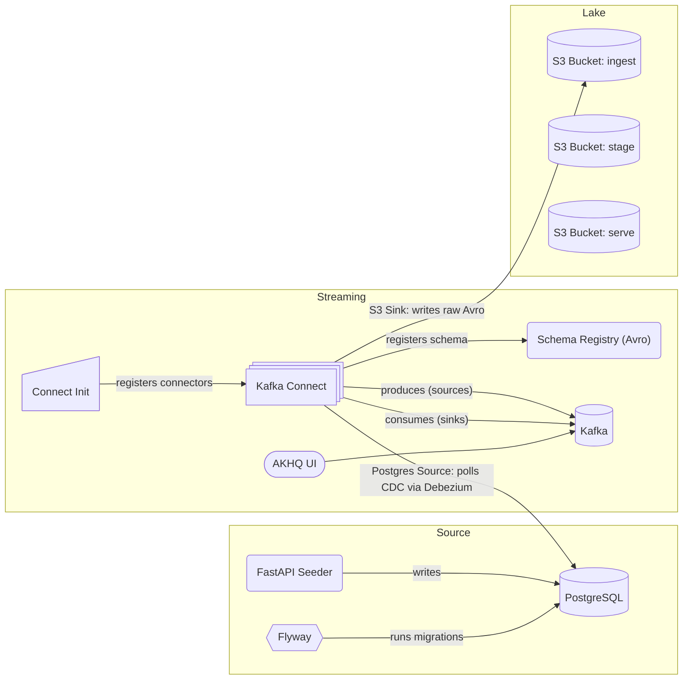

# haus-am-see

Data playground by the lake; meant to simulate end-to-end data pipelines.

## 🌊 Getting Started

Run the stack in layers:

```bash
# Source and Seeder
docker compose -f docker-compose.source.yaml up

# Streaming
docker compose -f docker-compose.streaming.yaml up

# Lake
docker compose -f docker-compose.lake.yaml up
```

### 🔍 Does It Work? Do:

1. **Seed the source DB:** Use FastAPI at [localhost:8000/docs](http://localhost:8000/docs) to insert an initial load or a continuous stream of records.
2. **Verify in Postgres:** Connect to `localhost:4444` with user:password `postgres:postgres`.
3. **Inspect Kafka:** Check AKHQ on [localhost:8080](http://localhost:8080) to view topics and schemas.
4. **S3 Buckets:** Check buckets (ingest, stage, serve) at [localhost:9001](http://localhost:9001) with user:password `minio:minio123`.

### 🗺️ Architecture



## 🧱 Source (Postgres)

Postgres is used as OLTP source. The default `storefront` database is meant to simulate a web shop.

- Connect via `localhost:4444` | user:password: `postgres:postgres`
- You can create a new database with, e.g.:
  ```bash
  docker compose -f docker-compose.source.yaml exec postgres psql -U postgres -d postgres -c "CREATE DATABASE storefront;"
  ```
- If meant to be persisted, add the new database to `postgres-init/init.sql`.

### 📦 Migrations

Flyway is used as migration tool.

- Run migrations on the default `storefront` database via:
  ```bash
  docker compose -f docker-compose.source.yaml up flyway
  ```

### 🌱 FastAPI Seeder

Use the endpoints on [localhost:8000/docs](http://localhost:8000/docs) to run a initial fill or start/stop continuous, simulated traffic.

## ⚡ Streaming (Kafka)

Kafka is used for streaming CDC events from Postgres via Debezium to the S3 ingest sink in the lake. You can use the AKHQ UI at [localhost:8080](http://localhost:8080) to monitor/manage it.

### 🔌 Connectors

All connectors are defined in `connectors/*.template.json`. envsubst is used to substitute `.env` variables.

- Register connectors:
  ```bash
  docker compose -f docker-compose.streaming.yaml up connect-init
  ```
- List registered connectors:
  ```bash
  curl http://localhost:8083/connectors
  ```
- Check connector status:
  ```bash
  curl http://localhost:8083/connectors/postgres-source-storefront/status
  ```
- Delete connector:
  ```bash
  curl -X DELETE http://localhost:8083/connectors/postgres-source-storefront
  ```

### 🔄 Debezium CDC on Postgres

Currently, CDC for Postgres is handled by Debezium. This includes:

- the addition of the connector plugin to the `Dockerfile.connect` image
- the creation of the Debezium user with the appropriate roles in Postgres `migrations/V2__create_debezium_user.sql`
- the proper connector config `connectors/debezium-postgres.template.json`
- Postgres' write-ahead log set to allow logical replication, see `wal_level=logical` in `compose/postgresql.custom.conf`

### 🧵 Topics

Strategy, example with Postgres CDC:

- Default setting `delete.retention.ms` is `86400000` (1 day). That is, either downstream is polling all messages or the connector has to be reset to push an initial snapshot to Kafka. To reset the Debezium connector, delete it and re-run the connect-init.
- Default setting `cleanup.policy` is `delete`. However, `compact,delete` can make sense for a lakehouse downstream.

## 🌊 Lake (S3 via MinIO)

MinIO is used as AWS S3 equivalent object store. Zones (buckets):

- `ingest`: raw data, e.g., Avro messages
- `stage`: structured, cleaned data
- `serve`: final business layer

You can explore the lake buckets using the MinIO UI. Check [localhost:9001](http://localhost:9001) to monitor/manage buckets; user:password: `minio:minio123`.

The buckets are created and initialized via the MinIO client `mc` during `docker-compose.lake.yaml` startup, defined in `compose/entrypoint.miniomc.sh`.

## 🧪 Development

### 📓 Notebooks

Jupyter notebooks can be found in `jupyter/`. Make sure to add the requirements in `jupyter/requirements.txt`.

### 🧼 Linting

Pre-commit is used for linting. Run `pre-commit install` once to initialize it for this repo.
