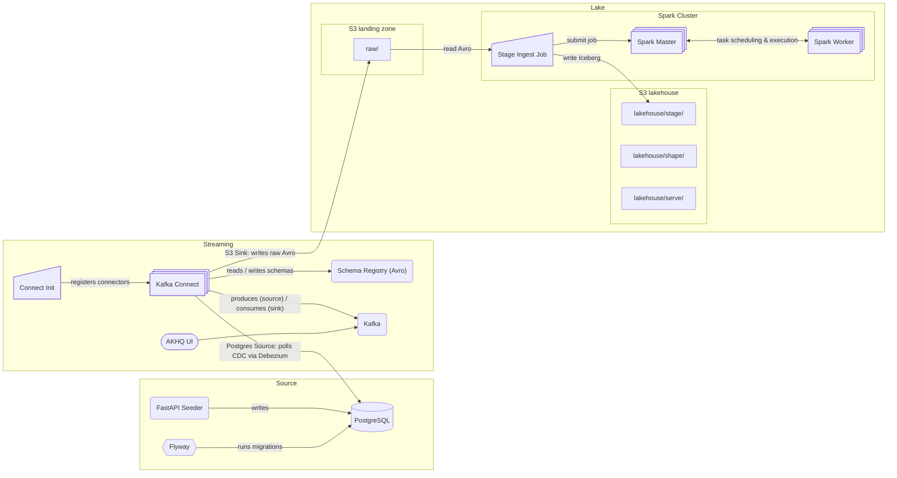

# haus-am-see

Data playground by the lake; meant to simulate end-to-end data pipelines.

## Getting started

1. Compose up source services: `docker compose -f docker-compose.source.yaml up`
   1. Use the FastAI seeder at [localhost:8000/docs](http://localhost:8000/docs) and run /seed/full to generate records in the source Postgres
   2. [Optional] Connect to the Postgres `localhost:4444` with user:password `postgres:postgres`. You can find the generated records in the storefront db.

2. Compose up streaming services: `docker compose -f docker-compose.streaming.yaml up`
   1. Register the Postgres connector with `docker compose -f docker-compose.streaming.yaml run --rm connect-postgres`. This will initially full load all records and keep streaming via CDC.
   2. [Optional] Check AKHQ on [localhost:8080](http://localhost:8080) to view the created topics and schemas.

3. Compose up lake services: `docker compose -f docker-compose.lake.yaml up`
   1. Check buckets (raw, lakehouse) at [localhost:9001](http://localhost:9001) with user:password `minio:minio123`.
   2. Register the S3 connector with `docker compose -f docker-compose.streaming.yaml run --rm connect-s3`. This will initially full load all records and keep streaming the registered topics into the `raw` bucket.

4. Run the ingest from `raw/` to `stage/` in the data lake using Spark. See [Spark processing](#spark-processing).

### Compose overview:

```bash
# Source
docker compose -f docker-compose.source.yaml up

# Streaming
docker compose -f docker-compose.streaming.yaml up

# Lake
docker compose -f docker-compose.lake.yaml up

# Register connectors
docker compose -f docker-compose.streaming.yaml run --rm connect-postgres
docker compose -f docker-compose.streaming.yaml run --rm connect-s3
```

### Architecture



## Source (Postgres)

Postgres is used as OLTP source. The default `storefront` database is meant to simulate a web shop.

- Connect via `localhost:4444` | user:password: `postgres:postgres`
- You can create a new database with, e.g.:
  ```bash
  docker compose -f docker-compose.source.yaml exec postgres psql -U postgres -d postgres -c "CREATE DATABASE storefront;"
  ```
- If meant to be persisted, add the new database to `postgres-init/init.sql`.

### Migrations

Flyway is used as migration tool.

- Run migrations on the default `storefront` database via:
  ```bash
  docker compose -f docker-compose.source.yaml up flyway
  ```

### FastAPI Seeder

Use the endpoints on [localhost:8000/docs](http://localhost:8000/docs) to run a initial fill or start/stop continuous, simulated traffic.

## Streaming (Kafka)

Kafka is used for streaming CDC events from Postgres via Debezium to the S3 ingest sink in the lake. You can use the AKHQ UI at [localhost:8080](http://localhost:8080) to monitor/manage it.

### Connectors

All connectors are defined in `connectors/*.template.json`. envsubst is used to substitute `.env` variables.

- Register connector:

  ```bash
  # Postgres Source
  docker compose -f docker-compose.streaming.yaml up connect-postgres
  # S3 Sink
  docker compose -f docker-compose.streaming.yaml up connect-s3

  # .. per curl
  curl -X POST -H "Content-Type: application/json" --data "@/connectors/postgres-source.json" http://connect:8083/connectors;
  ```

- List registered connectors:
  ```bash
  curl http://localhost:8083/connectors
  ```
- Check connector status:
  ```bash
  curl http://localhost:8083/connectors/postgres-source-storefront/status
  ```
- Delete connector:
  ```bash
  curl -X DELETE http://localhost:8083/connectors/postgres-source-storefront
  ```

To add a new connector, create a template in `connectors/*.template.json` and either register it manually (see command above) or add another service to `docker-compose.streaming.yaml`.

#### S3 Sink:

Example of resetting a sink connector:

```bash
# Delete connector
curl -X DELETE http://localhost:8083/connectors/s3-sink-storefront

# Reset offsets
docker exec -it kafka kafka-consumer-groups \
  --bootstrap-server localhost:9092 \
  --group connect-s3-sink-storefront \
  --reset-offsets \
  --all-topics \
  --to-earliest \
  --execute

# Add connector
docker compose -f docker-compose.streaming.yaml run --rm connect-s3
```

### Debezium CDC on Postgres

Currently, CDC for Postgres is handled by Debezium. This includes:

- the addition of the connector plugin to the `Dockerfile.connect` image
- the creation of the Debezium user with the appropriate roles in Postgres `migrations/V2__create_debezium_user.sql`
- the proper connector config `connectors/debezium-postgres.template.json`
- Postgres' write-ahead log set to allow logical replication, see `wal_level=logical` in `compose/postgresql.custom.conf`

Debezium adds per default additional information to each event. Example event:

```python
[{'before': None,
  'after': {'id': 1,
   'customer_id': 473,
   'status': 'cancelled',
   'total': Decimal('1124.84'),
   'created_at': 1743859191675403},
  'source': {'version': '2.5.4.Final',
   'connector': 'postgresql',
   'name': 'storefront',
   'ts_ms': 1743859335320,
   'snapshot': 'first_in_data_collection',
   'db': 'storefront',
   'sequence': '[null,"40034744"]',
   'schema': 'public',
   'table': 'orders',
   'txId': 776,
   'lsn': 40034744,
   'xmin': None},
  'op': 'r',
  'ts_ms': 1743859344573,
  'transaction': None},
]
```

- `after`: the current row state (used for inserts, updates, snapshots)
- `before`: previous row state (only present for updates and deletes)
- `op`: the operation type:
  - `'c'` = create
  - `'u'` = update
  - `'d'` = delete
  - `'r'` = snapshot (initial load)
- `ts_ms`: Debezium event timestamp in milliseconds (Kafka-side)

**Inside `source`:**

- `version`: Debezium connector version
- `connector`: connector type (`postgresql`, `mysql`, etc.)
- `name`: logical replication slot / Kafka topic prefix (`storefront`)
- `ts_ms`: source commit timestamp (PostgreSQL `clock_timestamp()`)
- `snapshot`: snapshot phase flag (e.g. `'first_in_data_collection'`)
- `db`: source database name
- `schema`: source schema name (e.g. `'public'`)
- `table`: source table name (e.g. `'orders'`)
- `sequence`: logical decoding LSN sequence (for ordering)
- `txId`: transaction ID (Postgres `txid_current()`)
- `lsn`: Postgres Log Sequence Number (WAL position)
- `xmin`: Postgres transaction snapshot xmin (for MVCC tracking)

**Other top-level fields:**

- `transaction`: info on wrapping transaction (may include order, ID)

### Topics

Strategy, example with Postgres CDC:

- Default setting `delete.retention.ms` is `86400000` (1 day). That is, either downstream is polling all messages or the connector has to be reset to push an initial snapshot to Kafka. To reset the Debezium connector, delete it and re-run the connect-init.
- Default setting `cleanup.policy` is `delete`. However, `compact,delete` can make sense for a lakehouse downstream.

## Lake

MinIO is used as AWS S3 equivalent object store. Zones (buckets):

- `raw`: raw data, e.g., Avro messages
- `lakehouse`: structured formats, e.g. Iceberg tables, with semantic sub-zones `stage`, `shape`, `serve` -- following a classic Medallion architecture.

You can explore the lake buckets using the MinIO UI. Check [localhost:9001](http://localhost:9001) to monitor/manage buckets; user:password: `minio:minio123`.

The buckets are created and initialized via the MinIO client `mc` during `docker-compose.lake.yaml` startup, defined in `compose/entrypoint.miniomc.sh`.

### Spark processing

The Spark cluster contains a master and a worker node to simulate scaling. See `docker-compose.lake.yaml` for their setup. Included services:

- `spark-master`: master node and scheduler; UI at [localhost:8085](http://localhost:8085)
- `spark-worker`: worker node
- `spark-notebook`: used for creating and managing jobs. Use:
  - JupyterLab at [localhost:8888](http://localhost:8888) for a notebook UI
  - The Spark Job UI at [localhost:4040](http://localhost:4040), available only while a job is running

### Spark Iceberg catalog config:

- `spark.sql.catalog.<catalog>`: bind a Spark catalog name to an Iceberg implementation class
  e.g. `spark.sql.catalog.lakehouse=org.apache.iceberg.spark.SparkCatalog`
- `spark.sql.catalog.<catalog>.type`: Iceberg catalog backend (`hadoop`, `rest`, etc.); in Hadoop, tables are laid out directly in a filesystem like S3/MinIO
- `spark.sql.catalog.<catalog>.warehouse`: root storage path for all namespaces/tables (bucket + optional prefix)
  e.g. `s3a://lakehouse/` → `lakehouse.stage.storefront.customers` maps to `s3a://lakehouse/stage/storefront/customers/`

#### Raw → Stage (bronze)

- For running Spark queries, use the JupyterLab instance at [localhost:8888](http://localhost:8888). It uses the same image as the Spark Master/Worker.
- Run `spark/jobs/storefront_raw_stage.py` via JupyterLab or directly with the container by running `docker compose -f docker-compose.lake.yaml run --rm spark-notebook python /home/spark/work/jobs/storefront_raw_stage.py`

The ingest uses `spark/jobs/stage_tables.yaml` (dbt inspired syntax) to project, cast, and partition columns. It sets `event_date` for partitioning, either from a business timestamp (e.g., `created_at`) or from Kafka's ingest time (`ts_ms`) as fallback. For lineage, the source is recorded as `event_date_source`.

`scripts/snippets.ipynb` contains a schema-config generator and Polars snippets for inspecting generated Iceberg tables.

## Development

### Notebooks

Jupyter notebooks can be found in `scripts/`. Make sure to add the requirements in `scripts/requirements.txt`.

### Linting

Pre-commit is used for linting. Run `pre-commit install` once to initialize it for this repo.
